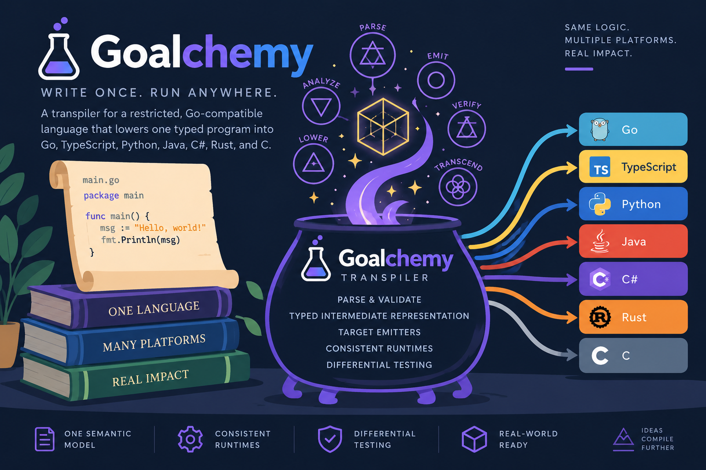

<p align="center">
  
</p>

# Goalchemy

Goalchemy is a transpiler for a restricted, Go-compatible language. You write a program once as ordinary `.go` files, and Goalchemy lowers it to **Go, TypeScript, Python, Java, C#, Rust, and C** with the same observable behavior on every target.

The source is plain Go: it builds, runs, and tests with the standard Go toolchain, and needs no new syntax or custom parser. Goalchemy accepts the subset of Go described in the [language specification](specs/language.md) and rejects everything else with a clear diagnostic.

## Why

Shipping the same logic as an SDK in several languages usually means maintaining several hand-written ports that drift apart. Goalchemy keeps one typed source of truth and generates each port from it. The motivating workload is the [OpenTDF](https://github.com/opentdf/platform) SDK, whose encryption and decryption logic needs to behave identically across languages.

## Scope

Goalchemy is a framework for building one SDK that ships in several languages. You write the SDK's logic once, in a restricted subset of Go, and Goalchemy generates the Go, TypeScript, Python, Java, C#, Rust, and C packages from it with the same behavior.

It is **not** a general-purpose transpiler. It won't convert arbitrary Go programs, and it doesn't try to reproduce the whole Go standard library on every target.

The runtime library is deliberately small:

- **Goalchemy provides** the language runtime, a set of pure-logic `std/` packages (strings, conversions, sorting, encodings), and a few host capabilities that most SDKs need (crypto, HTTP, clocks).
- **Each SDK is designed to provide** everything specific to its domain, including its own capabilities: declared with Go signatures and contracts, implemented natively per target, and checked against the same contracts and tests as Goalchemy's own.

If a feature is useful to only one SDK, it belongs in that SDK, not in Goalchemy.

## Scope

Goalchemy is a framework for building one SDK that ships in several languages. You write the SDK's logic once, in a restricted subset of Go, and Goalchemy generates the Go, TypeScript, Python, Java, C#, Rust, and C packages from it with the same behavior.

It is **not** a general-purpose transpiler. It won't convert arbitrary Go programs, and it doesn't try to reproduce the whole Go standard library on every target.

The runtime library is deliberately small:

- **Goalchemy provides** the language runtime, a set of pure-logic `std/` packages (strings, conversions, sorting, encodings), and a few host capabilities that most SDKs need (crypto, HTTP, clocks).
- **Each SDK is designed to provide** everything specific to its domain, including its own capabilities: declared with Go signatures and contracts, implemented natively per target, and checked against the same contracts and tests as Goalchemy's own.

If a feature is useful to only one SDK, it belongs in that SDK, not in Goalchemy.

## How it works

1. **Load and validate.** Packages are loaded and type-checked with `go/packages` and `go/types`, then checked against the language gate. Unsupported constructs fail closed with a stable code, source span, and one-line remedy.
2. **Lower to a typed IR.** A project-owned intermediate representation makes evaluation order, value copies, aliasing, and runtime operations explicit, so emitters never decide semantics.
3. **Emit and link.** Each target emitter writes source code plus only the runtime files the program needs. Every runtime function has one implementation file per target and a canonical YAML [contract](specs/runtime) that defines its behavior.
4. **Verify.** Differential tests compare native Go, lowered Go, and every other target against the same fixtures and contract cases.

Notable semantics that hold on every target:

- `int` and `uint` are always 64-bit, with Go's wrapping and conversion rules.
- Strings are immutable byte sequences; slices and maps keep Go's sharing and aliasing.
- Structs and arrays are copied by value, even on hosts that share objects by default.
- Errors are values; panics, `defer`, and `recover` follow Go's rules.
- Concurrency (`go`, channels, `select`, `sync`, `context`) runs on a deterministic cooperative scheduler under the `cooperative` gate.

## Install

Goalchemy is built with the Go 1.27.1 reference toolchain:

```sh
go install github.com/eugenioenko/goalchemy/cmd/goalchemy@latest
```

Or from a checkout:

```sh
go build -o bin/goalchemy ./cmd/goalchemy
```

## Quick start

```sh
mkdir hello && cd hello
go mod init example.com/hello
go get github.com/eugenioenko/goalchemy@latest
cat > main.go <<'GO'
package main

func main() {
    println("Hello from Goalchemy")
}
GO

goalchemy check .
goalchemy run -target python .
goalchemy compile -target rust -out out/rust .
```

The `go get` makes Goalchemy's packages resolvable from your module. Source modules must declare `go 1.25` or earlier. Programs print with Go's `print` and `println` builtins.

## Runtime library

The Go standard library is replaced by packages that keep the standard names, so code still reads and runs as ordinary Go:

- [`std/`](std): pure-logic packages (`strings`, `strconv`, `bytes`, `sort`, `unicode`, `unicode/utf8`, `encoding/hex`, `encoding/binary`) written once in the Goalchemy subset and compiled with your program. They behave identically on every target with no native dependencies.
- [`lib/`](lib): capability packages that reach the host (`crypto`, `http`, `encoding`, `clock`, `callback`, `sync`, `context`, `time`, `errors`). Each has a native implementation per target, checked against a contract.

The [runtime library reference](docs/library.md) explains the split and documents every function.

## Planned runtime additions

These are the gaps most SDKs and programs hit today, in priority order. Each lands in `std/` when it is pure logic and in `lib/` when it needs the host.

| Addition | Root | Notes |
| --- | --- | --- |
| `fmt`: `Sprint`, `Sprintf`, `Errorf` with `%w` | `std/` | String formatting and wrapped errors. |
| `fmt`: `Print`, `Println` | `lib/` | Writes to stdout through a small host capability. |
| `errors.As`, `errors.Join` | `std/` or `lib/` | Typed and joined errors for SDK error handling. |
| `time.Now` with sub-second precision, RFC 3339 formatting and parsing | `lib/` and `std/` | `clock.Unix` only has whole seconds today. |
| `os.Getenv` | `lib/` | Reports "not set" where the host has no environment, such as browsers. |
| Logging hook | `lib/` | Lets an SDK emit log records that the host application routes to its own logger. |
| `os.ReadFile`, `os.WriteFile` | `lib/` | Returns an error where the host has no file system, such as browsers. |
| `os.Args`, `os.Exit`, stdin | `lib/` | For programs and examples; SDKs rarely need them. |
| `net/url` | `std/` | URL parsing and query escaping. |
| `encoding/json` | `std/` | Needs compiler-generated type descriptors because source reflection is excluded; a separate design project. |

Domain formats such as ZIP archives for OpenTDF are candidates for the SDK that needs them rather than for Goalchemy, per the scope above.

## Planned runtime additions

These are the gaps most SDKs and programs hit today, in priority order. Each lands in `std/` when it is pure logic and in `lib/` when it needs the host.

| Addition | Root | Notes |
| --- | --- | --- |
| `fmt`: `Sprint`, `Sprintf`, `Errorf` with `%w` | `std/` | String formatting and wrapped errors. |
| `fmt`: `Print`, `Println` | `lib/` | Writes to stdout through a small host capability. |
| `errors.As`, `errors.Join` | `std/` or `lib/` | Typed and joined errors for SDK error handling. |
| `time.Now` with sub-second precision, RFC 3339 formatting and parsing | `lib/` and `std/` | `clock.Unix` only has whole seconds today. |
| `os.Getenv` | `lib/` | Reports "not set" where the host has no environment, such as browsers. |
| Logging hook | `lib/` | Lets an SDK emit log records that the host application routes to its own logger. |
| `os.ReadFile`, `os.WriteFile` | `lib/` | Returns an error where the host has no file system, such as browsers. |
| `os.Args`, `os.Exit`, stdin | `lib/` | For programs and examples; SDKs rarely need them. |
| `net/url` | `std/` | URL parsing and query escaping. |
| `encoding/json` | `std/` | Needs compiler-generated type descriptors because source reflection is excluded; a separate design project. |

Domain formats such as ZIP archives for OpenTDF are candidates for the SDK that needs them rather than for Goalchemy, per the scope above.

## CLI

| Command | Purpose |
| --- | --- |
| `goalchemy check [packages]` | Load, type-check, and validate against the language gate. |
| `goalchemy compile -target <name> -out <dir> [packages]` | Write a complete, runnable target directory. `-target ir` dumps the IR. |
| `goalchemy run -target <name> [-keep] [packages]` | Compile to a temporary directory and run the program. |
| `goalchemy build [-config goalchemy.yaml]` | Compile every target listed in a project configuration. |
| `goalchemy features` | Print supported language features per gate and target. |
| `goalchemy spec validate` / `spec generate [-check]` | Validate the contract catalog and regenerate target specs. |
| `goalchemy test` | Run runtime contract cases through each target's harness. |
| `goalchemy version` | Print the compiler version. |

`check`, `compile`, and `run` share these flags:

| Flag | Meaning |
| --- | --- |
| `-gate sequential\|cooperative` | Language gate; `cooperative` enables tasks, channels, and `select`. |
| `-tags a,b` | Build tags used when loading packages. |
| `-C <dir>` | Directory to load packages from. |
| `-json` | Write diagnostics as JSON. |

A project can list its targets in `goalchemy.yaml` and build them all at once:

```yaml
schema_version: 1
packages: [.]
gate: sequential
targets:
  go: {out: out/go}
  typescript: {out: out/ts}
  python: {out: out/py}
  rust: {out: out/rs}
```

Non-`main` packages compile to value libraries for every target. See the [usage guide](docs/usage.md) for library boundaries and output layout.

## Targets

| Target | Output | To run generated programs |
| --- | --- | --- |
| Go | `main.go`, `go.mod` | Go 1.25 or later |
| TypeScript | `main.ts` (ES2022) | Node.js 22.6 or later |
| Python | `main.py` | Python 3.10 or later |
| Java | `Main.java`, `run.sh` | JDK 21 or later |
| C# | `Main.cs`, `main.csproj` | .NET SDK 8 |
| Rust | `src/main.rs`, `Cargo.toml` | Stable Rust, edition 2021 |
| C | `main.c`, `run.sh` | C17 compiler and bdwgc 8.x with threads |

Each output directory also contains its runtime files, a `README.md`, a line map back to the Go source, and a `goalchemy.manifest.json` recording the compiler version, contracts, and files. Output is deterministic for the same inputs.

## Examples

The [`examples/`](examples) directory has complete programs with a `goalchemy.yaml` for all seven targets:

- [`bank`](examples/bank): typed errors, interfaces, and deferred audit logging
- [`calc`](examples/calc): an integer expression parser and evaluator
- [`life`](examples/life): Conway's Game of Life on a toroidal board
- [`wordfreq`](examples/wordfreq): word counting and ranking

```sh
goalchemy run -target python ./examples/calc
cd examples/bank && goalchemy build
```

## Documentation

| Topic | Reference |
| --- | --- |
| Commands, configuration, output, libraries | [Usage guide](docs/usage.md) |
| Runtime library: `std/` and `lib/` packages | [Library reference](docs/library.md) |
| Accepted language and semantics | [Language specification](specs/language.md) |
| Diagnostic codes | [Diagnostics](specs/diagnostics.md) |
| Supported feature matrix | [`specs/features.yaml`](specs/features.yaml) |
| Runtime and type contracts | [`specs/runtime`](specs/runtime), [`specs/types`](specs/types) |
| Host lifecycles per target | [Host operations](docs/host-operations.md) |
| Testing, toolchains, reports | [Hardening](docs/hardening.md) |
| Known limits and future work | [Follow-ups](docs/followups.md) |
| Design and roadmap | [Implementation plan](plan.md) |

Per-target details live in [`docs/`](docs): library boundaries, byte storage, and host operations for TypeScript, Python, Java, C#, Rust, and C.

## License

Goalchemy is licensed under [Apache-2.0](LICENSE).
